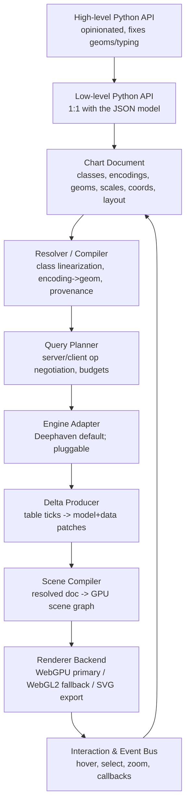

# Unified Plotting Library — Design Plan

Status: design proposal (iterate on specifics; core decisions are committed)
Scope: a single, delta-aware, high-performance, column-oriented plotting
library exposing a shared Python API over a declarative JSON model, rendered on
WebGPU (with a WebGL2 fallback), and optimized for — but not bound to — the
Deephaven ticking-table engine.

This document specifies the architecture, the chart model, the resolution and
delta pipelines, and a committed set of design decisions. It is intentionally
lower-level than a napkin vision but higher-level than a spec: each numbered
component is expected to graduate into its own detailed design doc. Where the
original brainstorm left questions open, this revision **resolves them** and
records the rationale in the decision log (§13).

---

## 1. Objectives and Non-Goals

### 1.1 Objectives

1. **Delta-aware.** Every data and configuration change propagates as a minimal
   patch. The renderer never re-materializes a chart it can incrementally update.
2. **High performance.** GPU-resident columnar buffers; downsampling and
   level-of-detail are first-class, not add-ons. Target: interactive frame rates
   on tens of millions of points, bounded by pixels and GPU memory, not row count.
3. **Flexible and extensible.** A permissive low-level model that gatekeeps
   nothing, plus opinionated high-level APIs. New geoms, scales, stats, engines,
   and renderers are registrable without forking the core.
4. **Column-based.** Data is columnar end-to-end (Arrow-compatible). The engine
   performs aggregation, binning, and downsampling; the client renders results.
5. **Legible to agents and humans.** The JSON model is declarative, addressable
   by stable IDs, inheritable via classes, and **compilable** to a fully resolved,
   provenance-annotated form for debugging and machine reasoning.

### 1.2 Non-Goals

- Not a general 2D scene/illustration tool; shapes exist to serve charts.
- Not a dashboarding/layout framework beyond what charts and subcharts require.
- Not committed to reproducing every exotic chart type; breadth is bounded by
  what the columnar + GPU + delta model can serve performantly (§14 gate).

### 1.3 The performance / flexibility / extensibility gate

Every feature in this plan must pass three tests, or it is cut or deferred:

- **Performant:** it must not force per-row work on the main thread, must be
  expressible as columnar/GPU operations or engine-side ops, and must support
  incremental (delta) updates.
- **Flexible:** it must be expressible in the low-level JSON model without a
  bespoke code path, and composable with inheritance, scales, and layout.
- **Extensible:** it must be registrable through a documented extension point
  (geom, stat, scale, coord, engine op, or renderer backend) rather than hard-coded.

---

## 2. System Architecture



Component responsibilities and the contracts between them:

| Component        | Input                      | Output                         | Contract                                                            |
| ---------------- | -------------------------- | ------------------------------ | ------------------------------------------------------------------- |
| Low-level API    | Python calls               | Chart Document (JSON)          | Everything expressible in JSON; no hidden capabilities.             |
| Resolver         | Document                   | Resolved Document + provenance | Deterministic; pure function of the document + registry.            |
| Query Planner    | Resolved Document          | Op plan (server vs. client)    | Cost-based; respects capability flags and budgets (§8).             |
| Engine Adapter   | Op plan + table refs       | Columnar result handles        | Abstract ops (bin, aggregate, downsample); Deephaven default.       |
| Delta Producer   | Engine updates             | Model patch + data patch       | RFC 6902-style model patches; columnar row-range data patches (§7). |
| Scene Compiler   | Resolved Document + data   | GPU scene graph                | Backend-agnostic; no DOM/GPU calls itself.                          |
| Renderer Backend | Scene graph + data buffers | Pixels + hit-test structures   | Swappable (WebGPU/WebGL2/SVG); identical scene-graph interface.     |
| Event Bus        | Pointer/keyboard, engine   | Model patches + user callbacks | Interactions are model mutations; round-trip through the document.  |

**Threading.** The resolver, planner, delta producer, and scene compiler run in
a worker; the renderer owns the GPU device. The main thread only marshals
pointer events and applies compiled draw commands. This keeps authoring and
delta work off the UI thread (satisfies the "warn if slow, never block" goal).

---

## 3. The Chart Document

The Chart Document is the single source of truth. It is a JSON object with a
versioned schema (published as JSON Schema for validation, editor generation,
and agent tool-use). Its top-level shape:

```
Document
├── version            // schema version, for migration
├── data               // named data sources (engine table refs, inline, derived)
├── classes            // reusable, inheritable property bundles ("red_scatter")
├── theme              // top-level class applied to the whole document
├── scales             // named scales/guides (color, size, x, y, ...)
├── coords             // coordinate systems (cartesian, polar, geo, 3d, none)
├── layout             // constraint-based box layout of frames
└── frames[]           // panels; each holds marks and/or nested subcharts
     └── marks[]       // series and shapes (the unit of rendering)
```

### 3.1 Nodes, IDs, and addressing

Every node (frame, mark, scale, axis, class) carries a **stable ID**. IDs are
JSON-Pointer-addressable (`/frames/0/marks/2`) and also carry an optional
author-assigned `id` used for patches, events, and editor targeting. Stable
addressing is what makes deltas, provenance, and linked selection tractable.

### 3.2 Marks: series and shapes are one vocabulary

A **mark** is the unit of rendering. There are two kinds, sharing one schema:

- **Series** — data-bound marks. A series is a _geom template repeated over the
  rows of a data source_ through encoding channels (§3.3).
- **Shapes** — singleton marks (reference line, region, annotation, custom path)
  positioned in data or paper coordinates.

Because a series is formally "a shape templated over data," annotations and data
marks share positioning, styling, and layout. Shapes may also be _data-bound_
(e.g. one reference band per group), which unifies annotations with faceting.

### 3.3 Encoding channels (the core model)

The core mental model is a **grammar of graphics**: a mark binds _channels_ to
_data fields or constants_, and a _geom_ interprets those channels. Channels:

`x`, `y`, `z`, `x2`, `y2` (ranged geoms), `color`, `fill`, `size`, `shape`,
`opacity`, `angle`, `text`, `detail` (grouping without visual effect), `order`,
`key` (identity for delta/animation).

A channel binds to `{ field, scale?, stat?, value? }`. `stat` requests a
transform (§3.6); `scale` names the scale that maps data to visual units.

**Geom from arity (resolved).** The low-level model _accepts_ an explicit
`geom`. If omitted, the resolver infers one from the bound channels using a
fixed, documented table, and **writes the inferred geom back into the compiled
document** so nothing is hidden:

| Bound channels           | Inferred geom      | Coord     |
| ------------------------ | ------------------ | --------- |
| `x` only (quantitative)  | strip (horizontal) | cartesian |
| `y` only (quantitative)  | strip (vertical)   | cartesian |
| `x` + `y`                | point (scatter)    | cartesian |
| `x` + `y` + `z`          | point (3D)         | 3d        |
| `x` + `y2`/`x2` (ranged) | bar / interval     | cartesian |
| categorical `x` + `y`    | bar                | cartesian |
| `theta` (+ `radius`)     | arc (pie/donut)    | polar     |

Inference is a convenience of the _default_ high-level layer; it never blocks
the low-level model, and it is deterministic. Changing scatter→line is a
one-field change (`geom: "line"`) because both consume `x`/`y`. The high-level
API may pin the geom (e.g. `scatter()` forbids inference).

### 3.4 Coordinate systems

`coords` are named and referenced by frames. Built-ins: `cartesian` (linear/log/
symlog/time/categorical per axis), `polar`, `ternary`, `geo`, `3d`, and `none`
(paper-space only, for indicators/pie/treemap that need no axes). Coordinate
systems are an extension point: a new coord registers projection + axis
generators. Marks are written once against channels and _reused_ across coords
where geometrically meaningful.

### 3.5 Axes and the layout system (resolved)

**Decision:** layout is a **constraint-based box model** inspired by CSS
fl/grid, not Plotly's domain/anchor arithmetic. It is both declaratively
authorable and mechanically computable, and it reflows to its container.

- The document is a tree of **frames** (boxes). A frame has a computed content
  box and holds a plot area plus edge-attached guides (axes, legends, colorbars).
- Sizing units: `fr` (fractional/flex), `px`, `%` (of parent), `auto`
  (content-driven, e.g. an axis sized to its tick labels), plus `min`/`max`/
  `aspect` constraints. Gutters/margins are explicit.
- Placement is by **edge attachment** (`top`/`right`/`bottom`/`left`) and
  **fractional grid** cells for facets/subcharts — no absolute pixel math
  required, but absolute is allowed for hand-tuning.
- The solver is a single pass over a DAG of constraints (no iterative
  relaxation in the common case), so layout is fast and its results are
  inspectable (the compiled document contains the resolved boxes).

Multiple axes are first-class: an axis is a guide node bound to a scale and
attached to a frame edge; several axes per edge are allowed (e.g. dual-y).

### 3.6 Stats (declarative transforms)

A `stat` is an engine-abstracted transform requested by a channel or mark:
`bin`, `bin2d`, `count`, `sum`/`mean`/aggregation, `density`/`kde`, `quantile`
(box/violin), `smooth`/`regression`, `ecdf`, `hexbin`, `contour`. Stats keep
histogram/violin/regression _uniform_ — a histogram is `geom: bar` +
`stat: bin`, not a special chart type. The planner (§8) decides whether a stat
runs server-side (default for Deephaven) or client-side.

### 3.7 Scales and guides as first-class nodes

Scales (`x`, `y`, `color`, `size`, `shape`, `opacity`, …) are named document
nodes with type (`linear`, `log`, `symlog`, `time`, `ordinal`, `quantize`,
`threshold`, `sequential`, `diverging`), domain (explicit or data-derived),
range, and guide config (axis/legend/colorbar). Scales can be **shared** across
marks and frames (linked axes, shared color legend) or **independent** per facet.
Because scales are nodes, they inherit and compile like everything else.

### 3.8 Classes and inheritance (resolved)

**Decision:** a **flat class registry** with **linear `extends` chains** and
**explicit multi-class application** — no deeply nested class trees.

- `classes` is a flat map: `{ "red_scatter": { extends: "scatter", ... } }`.
- A node applies classes via `class: ["a", "b"]`. Precedence is resolved by
  **C3 linearization** (the Python MRO algorithm) over the combined `extends`
  graph, producing a deterministic, unambiguous order.
- **Merge algebra** (also resolved):
  - Objects **deep-merge** (later/nearer wins per key).
  - Scalars **replace**.
  - Arrays **replace by default**; arrays whose elements carry an `id`
    **merge by `id`**. Explicit patch operators (`$append`, `$prepend`,
    `$remove`, `$replace`) are available for the rare cases that need them.
  - A node's own inline properties always win over its classes.
- **Data is inheritable**: a class may carry `data`/encoding defaults, not just
  style, so "make everything read from table T" is a one-class change.
- **Theme** is just the document-level class; replacing it re-propagates.

This deliberately avoids the deep-vs-shallow ambiguity: nesting of _definitions_
is disallowed; _composition_ is achieved by listing multiple flat classes. The
merge rules are total and deterministic, which is what makes "compile + annotate
provenance" trivial to implement and to reason about.

### 3.9 Compilation and provenance

The resolver produces a **compiled document**: inheritance flattened, encodings
resolved to explicit geoms, scale domains materialized, layout boxes computed.
With provenance enabled, every leaf value is annotated with its origin (which
class, theme, override, or default). This is the primary debugging tool and the
"explain this chart" surface for agents. See the example in §12.

---

## 4. Rendering (resolved: WebGPU primary + WebGL2 fallback)

**Decision:** WebGPU is the primary backend; a WebGL2 backend implements the
same scene-graph interface for browsers/GPUs without WebGPU; an SVG/Canvas2D
backend serves static export and tiny charts. Backends are registrable, which is
also how alternate charting backends (§9) plug in.

- The **scene compiler** turns the resolved document + columnar buffers into a
  backend-agnostic scene graph: draw batches keyed by geom, referencing GPU
  buffers, scale uniforms, and hit-test metadata.
- Geoms are **pluggable render primitives** (point, line, area, bar/interval,
  arc, rect/heatmap cell, mesh/surface, text). Each geom provides a shader/
  pipeline for each backend plus a CPU hit-tester. New geoms register here.
- Data lives in **GPU-resident columnar buffers**; scale changes update uniforms
  (cheap), data changes update buffer sub-ranges (delta), and only geometry
  affected by a patch is re-encoded.
- **GPU precision (offset-encoded f32):** the canonical store keeps source dtype
  (i64 timestamps, f64) on the CPU; the GPU receives _relative_ f32 via a
  per-trace/axis `offset + scale` folded into the view transform (f64 on CPU).
  This preserves the 4-byte GPU footprint _and_ full precision for
  large-magnitude/small-delta domains (time, finance, geo); deep zoom re-centers
  the offset. Axis ticks and hover readouts are computed in f64/i64 and never go
  through f32. (See §20; borrowed from deck.gl RTC / reflex `xy`.)
- **GPU picking:** hover/select render integer IDs to an offscreen target with
  async readback — O(1) regardless of point count, no per-point CPU scan.
- **Real GPU ceilings:** tier selection considers not just point count but
  fill-rate (`count × mark_pixel_area × overdraw`) and the ~1 GB single-allocation
  cap; large buffers are chunked (multi-buffer draws) so the allocation cliff is
  unreachable.

---

## 5. Downsampling and Level-of-Detail

Downsampling is a first-class primitive and an engine-abstracted op:

- **Series reduction:** LTTB and min/max-per-pixel-bucket for lines/areas,
  preserving visual envelope. Configured as `downsample: { mode, target, strategy }`
  where `mode ∈ { off, count, auto }` and `auto` is viewport- and DPI-aware.
- **Density reduction:** point-heavy scatters/lines degrade to a binned density
  representation (heatmap/hexbin) past a configurable point budget — the same
  mechanism as `stat: bin2d`, so there is one code path.
- **Semantic zoom / LOD:** the compiled document may declare LOD tiers (points →
  hexbin → heatmap) selected by zoom level and point budget. Because tiers are
  just marks with visibility bound to a zoom signal, LOD needs no special engine.
- **Placement:** the planner prefers **server-side** reduction on Deephaven so
  only the pixels-worth of data crosses the wire, with client-side reduction as
  the fallback for engines that cannot do it.

### 5.1 Multi-tier LOD (the scale ladder)

The reduction primitives above compose into an explicit tier ladder whose
governing rule is: **never ship or draw more primitives than the screen has
pixels.** The tier is chosen per mark and re-chosen on zoom over the _visible
window only_, hysteresis-guarded to avoid thrashing:

1. **Direct** — raw columns, instanced draw. Exact. Budgeted by count _and_
   fill-rate (§4).
2. **Decimated** — M4 / min-max-per-pixel-column for lines/areas (keeps first,
   last, min, max so spikes and inter-column segments survive). Recomputed for
   the visible x-range only.
3. **Aggregated tile pyramid** — for massive scatter/heatmaps, a data-space
   pyramid of density tiles at power-of-two zoom levels (count/mean-color per
   cell). Pan = tile reuse; zoom = adjacent level; only zooming below the finest
   level re-bins, and only the visible window. Per-frame cost is O(visible tiles),
   not O(points). Colormapping happens at composite time, so restyle never re-bins.
4. **Out-of-core tiling** — for larger-than-RAM data, chunked columns paged by
   viewport with pre-aggregated overview tiles; resident memory stays
   screen-bounded, not data-bounded.

This makes **cost scale with pixels, not rows** — the central bet validated by
datashader, Falcon, imMens, and reflex `xy`. On Deephaven the pyramid/decimation
ops run server-side; the tile machinery is shared with out-of-core tiling.

### 5.2 Interaction latency model

Budgets that keep interaction smooth while heavier work happens off the critical
path:

- **Pan/zoom** — same frame: a uniform (view-matrix) update only, never blocks
  on recompute.
- **Tier rebuild after zoom** — non-blocking **stale-while-revalidate**: keep
  drawing the old tier transformed by the new view (right position, slightly
  wrong resolution), swap when the worker/engine delivers.
- **Re-bin on large data** — **progressive refinement**: bin a 1-in-k sample
  first (coarse density appears immediately), refine over subsequent frames.
- **Hover** — async GPU-pick readback, tolerating 1-frame staleness.

---

## 6. Data Model and Engine Integration

- **Data sources** are named: engine table refs (Deephaven default), inline
  columnar arrays, or **derived sources** (a source + a chain of stats/filters).
- Data is columnar and Arrow-compatible throughout; the client holds only what
  it renders (a viewport- and LOD-bounded window).
- **Deephaven optimization:** ticking tables drive the delta producer directly;
  server-side stats/downsampling minimize traffic; `plot_by` and business-time
  calendars are native (carried forward from the current stack).

---

## 7. Delta Protocol (resolved)

**Decision:** two coordinated patch channels, coalesced per animation frame.

1. **Model patches** — RFC 6902-style JSON Patch operations (`add`/`remove`/
   `replace`/`move`) against the document, addressed by JSON Pointer / node ID.
   Used for config changes, interactions, and structural updates.
2. **Data patches** — columnar, table-oriented: `{ source, added: rowRanges,
modified: rowRanges/cells, removed: rowRanges, shifts }`, mirroring Deephaven
   update semantics. Only affected buffer sub-ranges are re-uploaded to the GPU.

**Granularity decision:** the default unit is the **column/row-range**, not the
individual point (point-level diffs are supported but opt-in for small marks).
Patches are **coalesced** within a frame and applied atomically so the renderer
never shows a half-applied state. `key`/`order` channels drive stable
enter/update/exit for animated transitions.

### 7.1 Transfer cache — never send the same bytes twice

On top of the patch channels sits a **content-addressed, generation-keyed cache**
(adopted from reflex `xy`) so the wire carries only what the client provably
lacks:

- Every transferable unit (column chunk, pyramid tile, decimation buffer, filter
  slab) has a stable ID: `(source, tier, tile|chunk, data_generation, filter_hash)`.
  Entries are **immutable** — a changed tile is a _new_ ID, never an overwrite —
  so any ID the client holds is valid forever and eviction is pure LRU under a
  byte budget. There is no invalidation protocol to get wrong.
- **Manifest handshake:** on a state change the producer sends the ID list the
  new view needs (a few hundred bytes); the client replies with the subset it
  lacks; only those payloads ship. One round-trip, zero redundant bytes, and a
  reconnect (empty cache) needs no special path — it just lacks everything.
- **Per-interaction cost becomes explicit:** pan within cached tiles = 0 bytes;
  theme/style change = 0 bytes (client uniforms/LUT); filter toggle _back_ to a
  cached state = 0 bytes; new filter = recomputed visible tiles only.

### 7.2 Zone maps (chunk statistics)

At ingest, every column chunk gets a one-pass stats block
(`min, max, count, null_count, sum, sum_sq`, + dictionary cardinality). Nearly
free, and it buys **O(chunks) autorange** instead of O(rows), viewport chunk
pruning (Parquet-row-group-style), instant a11y summaries, and the domain for
deep-zoom offset re-centering (§20) — all without scanning raw data.

---

## 8. Query Planner and Op Negotiation (resolved)

**Decision:** a **capability- and cost-based planner** assigns each op (stat,
downsample, aggregate, filter) to server or client.

- Each engine adapter publishes **capability flags** (which ops it supports) and
  cost hints. Each renderer/backend publishes its own capabilities.
- The planner assigns an op **server-side** when the engine supports it and the
  data volume exceeds a budget (the common Deephaven case), otherwise
  **client-side**. Budgets are configurable (row count, bytes, latency target).
- If a required capability is unavailable anywhere, the document **fails loudly
  and early** (with a precise diagnostic), never silently degrading — this is the
  antidote to the Plots.jl-style feature-parity trap.

---

## 9. Extensibility and Alternate Backends

Registrable extension points, each with a stable interface:

- **Geoms** (render primitive + hit-tester), **stats** (transform + engine
  mapping), **scales**, **coordinate systems**, **engine adapters**, and
  **renderer backends**.
- Alternate **charting/rendering backends** (e.g. an SVG/vector backend, or a
  third-party GPU renderer) implement the scene-graph interface and share the
  same Python API and JSON document. Capability flags (§8) keep unsupported
  features honest.

---

## 10. Interactivity, Events, and Selections

- **Interactions as model mutations:** hover, click, box/lasso select, pan/zoom,
  legend toggles, and drag all emit model patches and/or fire server-side
  callbacks. This mirrors and generalizes the existing plotly-events design
  (see `plans/DH-22030-plotly-events.md`), including preventable-default events.
- **Selections are model state:** a selection is a named node holding a predicate
  or key set. Selections can drive other marks/frames (linked brushing) and can
  push down to the engine as filters (crossfilter), all through the same patch
  channel.
- **Signals:** lightweight reactive values (zoom level, selection, hovered key)
  that marks and LOD tiers bind to, evaluated in the worker.

---

## 11. Tooling: Editor, Provenance, Diagnostics

- **Schema-driven editor:** the published JSON Schema generates an editor UI, so
  the editor tracks capabilities automatically.
- **Provenance / "explain this chart":** the compiled, annotated document (§3.9)
  is both a human debugging aid and a machine-readable explanation for agents.
- **Authoring diagnostics:** resolution and data-fetch run in a worker and
  **warn when composition is slow** (large class graphs, expensive derived
  sources) rather than blocking, with timings attributed per node.

---

## 12. Example Chart Spec

A compact but representative document: a Deephaven-backed price chart with a
themed class, a shared color scale, server-side downsampling, a subchart for
volume, a dual axis, an annotation shape, and a selection. Illustrative field
names; not a frozen schema.

```jsonc
{
  "version": "1.0",

  "data": {
    "trades": { "engine": "deephaven", "table": "TradesTicking" },
    "daily": {
      "source": "trades",
      "stat": { "op": "bin", "field": "ts", "unit": "1d" }
    }
  },

  "theme": "corp_dark",

  "classes": {
    "corp_dark": {
      "palette": "viridis",
      "font": "Inter",
      "grid": { "color": "#333" }
    },
    "price_line": {
      "extends": "corp_dark",
      "geom": "line",
      "encode": {
        "x": { "field": "ts", "scale": "x" },
        "y": { "field": "price", "scale": "y" }
      },
      "downsample": { "mode": "auto", "strategy": "lttb" }
    },
    "red_scatter": {
      "extends": "corp_dark",
      "geom": "point",
      "style": { "color": "#e34" }
    }
  },

  "scales": {
    "x": { "type": "time", "domain": "auto" },
    "y": {
      "type": "log",
      "domain": "auto",
      "guide": { "axis": { "side": "left" } }
    },
    "y2": {
      "type": "linear",
      "domain": "auto",
      "guide": { "axis": { "side": "right" } }
    },
    "col": {
      "type": "ordinal",
      "field": "symbol",
      "range": "palette",
      "guide": { "legend": { "side": "right" } }
    }
  },

  "coords": { "main": { "type": "cartesian" } },

  "layout": {
    "type": "grid",
    "rows": ["3fr", "1fr"],
    "gap": "8px",
    "areas": { "price": [0, 0], "volume": [1, 0] }
  },

  "frames": [
    {
      "id": "price",
      "coord": "main",
      "area": "price",
      "marks": [
        {
          "id": "px",
          "class": ["price_line"],
          "encode": { "color": { "field": "symbol", "scale": "col" } }
        },

        {
          "id": "vwap",
          "class": ["price_line"],
          "data": "daily",
          "encode": { "y": { "field": "vwap", "scale": "y" } },
          "style": { "dash": "4 2" }
        },

        {
          "id": "settle",
          "kind": "shape",
          "shape": "rule",
          "encode": { "y": { "value": 100.0, "scale": "y" } },
          "style": { "color": "#888" },
          "label": "settlement"
        }
      ],
      "interactions": {
        "on_select": { "selection": "brush", "channel": "x" },
        "on_click": { "callback": "handle_point_click" }
      }
    },
    {
      "id": "volume",
      "coord": "main",
      "area": "volume",
      "marks": [
        {
          "id": "vol",
          "geom": "bar",
          "data": "daily",
          "encode": {
            "x": { "field": "ts", "scale": "x" },
            "y": { "field": "volume", "scale": "y2" },
            "color": { "field": "symbol", "scale": "col" }
          },
          "downsample": { "mode": "count", "target": 2000 }
        }
      ]
    }
  ],

  "selections": {
    "brush": { "type": "interval", "channel": "x", "pushdown": true }
  }
}
```

The **compiled + provenance-annotated** form of the `px` mark (excerpt) makes
inheritance and inference explicit:

```jsonc
{
  "id": "px",
  "geom": "line", // @from class:price_line
  "coord": "main",
  "encode": {
    "x": { "field": "ts", "scale": "x" }, // @from class:price_line
    "y": { "field": "price", "scale": "y" }, // @from class:price_line
    "color": { "field": "symbol", "scale": "col" } // @from node:inline
  },
  "style": { "font": "Inter" }, // @from theme:corp_dark
  "grid": { "color": "#333" }, // @from theme:corp_dark
  "downsample": { "mode": "auto", "strategy": "lttb", "target": 1440 },
  // mode/strategy @from class:price_line; target @from planner:auto(viewport)
  "plan": { "downsample": "server", "estimated_rows_out": 1440 } // @from query-planner
}
```

---

## 13. Decision Log (resolved questions & conflicts)

| #   | Question / conflict                                 | Decision                                                                                                                                             |
| --- | --------------------------------------------------- | ---------------------------------------------------------------------------------------------------------------------------------------------------- |
| 1   | Grammar vs. trace as the core model                 | **Grammar core** (channels + geoms + stats + scales). Traces are a _compiled artifact_.                                                              |
| 2   | Deep vs. shallow inheritance; is nesting allowed?   | **Flat class registry**, linear `extends`, C3 linearization; **no nested class trees**. Explicit merge algebra (§3.8).                               |
| 3   | Server-side vs. client-side ops                     | **Capability- + cost-based planner** (§8); server-side default on Deephaven; fail loudly if impossible.                                              |
| 4   | WebGPU-only vs. fallback                            | **WebGPU primary + WebGL2 fallback + SVG export**, one scene-graph interface (§4).                                                                   |
| 5   | How much typing inference is "magic"                | **Deterministic arity table** (§3.3); inference writes the geom back into the compiled doc; high-level API may pin it.                               |
| 6   | Delta granularity                                   | **Column/row-range default**, point-level opt-in; two channels (model + data); frame-coalesced, atomic (§7).                                         |
| 7   | Layout language ("CSS-like" without CSS complexity) | **Single-pass constraint box model** with `fr`/`px`/`%`/`auto` + edge attachment + grid; boxes materialized in compiled doc (§3.5).                  |
| 8   | Series vs. shapes as separate concepts              | **Unified marks** vocabulary; a series is a shape templated over data (§3.2).                                                                        |
| 9   | Backend feature-parity leakage (Plots.jl trap)      | **Capability flags** + early hard failure with diagnostics; never silent degradation (§8/§9).                                                        |
| 10  | Model versioning/migration                          | **Versioned schema** with forward migrations run by the resolver; documents declare `version`.                                                       |
| 11  | Numeric precision on the GPU                        | **Offset-encoded f32** with f64/i64 canonical on CPU; per-trace/axis `offset+scale`; deep-zoom re-centering; ticks/hover never f32 (§20).            |
| 12  | External CSS / Tailwind styling                     | **Three-surface model:** DOM chrome = plain CSS; marks = `--chart-*` custom-property token bridge; per-mark data-driven = spec-level (§18).          |
| 13  | Filtering, selection & linked views                 | **Three-tier filter model** (indexed range / visible-window re-bin / Falcon summed-area cube) + per-row selection bitmask; Deephaven pushdown (§19). |
| 14  | Wire efficiency                                     | **Content-addressed, generation+filter-keyed immutable cache** with manifest handshake — never send the same bytes twice (§7.1).                     |
| 15  | Null / gap semantics                                | **Arrow validity bitmaps** end-to-end; NaN never reaches vertex buffers; null inside a line = gap (§20).                                             |
| 16  | Interaction latency                                 | Pan/zoom = uniform-only same-frame; tier rebuild non-blocking via **stale-while-revalidate + progressive refinement**; async GPU picking (§5.2/§20). |
| 17  | Big-data tier ladder                                | **Direct → decimated → data-space tile pyramid → out-of-core tiling**; tier chosen on count _and_ fill-rate; chunked buffers (§5.1).                 |

---

## 14. Feature Set (comprehensive, each gated by §1.3)

Only features that pass the performant/flexible/extensible gate are listed. Each
is expressible in the JSON model and reducible to columnar/GPU or engine ops.

**Core data-visual**

- Encoding channels; geom-from-arity; explicit geom override.
- Geoms: point, line, area/band, step, bar/interval, arc, rect/heatmap cell,
  hexbin, boxplot, violin, candlestick/OHLC, mesh/surface, text/label.
- Stats: bin, bin2d, count, aggregate, density/kde, quantile, regression/smooth,
  ecdf, contour, hexbin — uniform across geoms.
- Scales: linear, log, symlog, time/business-time, ordinal, quantize, threshold,
  sequential, diverging; shared or independent; colorblind-safe default palettes.
- Guides: axes (multi-axis, dual-y), legends, colorbars — all interactive.

**Performance**

- Server-side and client-side downsampling (LTTB, min/max, density).
- Level-of-detail / semantic zoom tiers bound to zoom signals.
- GPU-resident columnar buffers; sub-range buffer updates on delta.
- Viewport-bounded data windows; worker-side resolve/plan/diff.

**Composition & layout**

- Flat inheritable classes + themes; provenance-annotated compilation.
- Constraint box layout; arbitrarily deep subcharts; faceting as layout
  (`facet_wrap`/`facet_grid`) via the same grid + shared/independent scales.
- Multiple coordinate systems (cartesian, polar, ternary, geo, 3d, none).

**Interactivity**

- Hover/tooltip templating, crosshair, pan/zoom with history, box/lasso select.
- Preventable-default server callbacks; legend interactions.
- Selections as model state; linked brushing; engine filter push-down (crossfilter).
- Streaming-native enter/update/exit transitions keyed by `key`/`order`.

**Tooling & integration**

- Published JSON Schema; schema-driven auto-editor.
- "Explain this chart" provenance for agents; per-node authoring timings/warnings.
- Deterministic export (SVG/PNG/PDF + the source JSON) for reproducibility and
  visual-regression testing.
- Accessibility layer (keyboard nav, ARIA, generated text descriptions).
- Deephaven `plot_by` and business-time calendars as native features.

**Styling & robustness (adopted from reflex `xy`)**

- External styling: DOM-chrome CSS/Tailwind + a `--chart-*` custom-property token
  bridge for marks; live re-resolution on theme/dark-mode change (§18).
- Offset-encoded f32 with f64/i64 canonical for exact time/finance/geo (§20).
- Arrow validity bitmaps; NaN-safe vertex buffers; null-as-gap line semantics (§20).
- Content-addressed transfer cache + manifest handshake; zone maps (§7.1/§7.2).
- Multi-tier LOD tile pyramid + out-of-core tiling; fill-rate-aware tiering (§5.1).
- Filtering, selection & linked brushing (Falcon summed-area cube) (§19).
- Async GPU picking; stale-while-revalidate + progressive refinement latency (§5.2).
- Determinism: CPU reference rasterizer as the CI oracle; per-backend perceptual
  diffs; asserted LOD decisions (§20).
- Dashboard scaling: WebGL/WebGPU context governor with LRU eviction (§20).

**Deferred (not yet gate-passing; revisit)**

- Network/graph and Sankey layouts (force/edge-routing are not naturally
  columnar/incremental — need a bounded, server-side layout strategy first).
- Fully arbitrary 2D vector illustration (out of scope by §1.2).

---

## 15. Supported-Plots Matrix (validation target)

Deliverable: a matrix mapping **each plot → geom(s), coord, required scales,
engine stat/op, and downsampling strategy** to prove the model covers breadth
without special cases. Seed rows:

| Plot             | Geom(s)      | Coord     | Stat/op         | Downsample      |
| ---------------- | ------------ | --------- | --------------- | --------------- |
| Scatter          | point        | cartesian | —               | density/hexbin  |
| Line/area        | line/area    | cartesian | —               | LTTB / min-max  |
| Bar (grouped)    | bar/interval | cartesian | aggregate       | count           |
| Histogram        | bar          | cartesian | bin             | server-side bin |
| 2D density       | rect/hexbin  | cartesian | bin2d/hexbin    | server-side bin |
| Box / violin     | box/violin   | cartesian | quantile/kde    | server-side     |
| OHLC/candlestick | candlestick  | cartesian | (agg)           | count           |
| Heatmap          | rect         | cartesian | bin2d/aggregate | server-side bin |
| Pie/donut        | arc          | polar     | sum             | —               |
| Sunburst/treemap | arc/rect     | none      | hierarchy       | —               |
| Indicator/KPI    | text/gauge   | none      | aggregate       | —               |
| 3D scatter/surf  | point/mesh   | 3d        | —/grid          | LOD             |
| Choropleth       | rect/path    | geo       | aggregate       | tile LOD        |

---

## 16. Roadmap (sequenced, non-binding)

1. **Document + resolver spike:** schema, node IDs, class linearization + merge
   algebra, encoding→geom inference, provenance compilation, published JSON Schema.
2. **Engine adapter + delta pipeline:** Deephaven ticking → columnar → dual-channel
   patches; one server-side op (downsampling) end-to-end.
3. **WebGPU core (x/y):** point + line geoms, downsampling primitive, one
   cartesian coord, the constraint layout solver; WebGL2 fallback stub.
4. **Interactivity + events:** hover/zoom/select, preventable callbacks, selections
   as model state with engine push-down.
5. **High-level Python API:** arity sugar, pinned-geom constructors, `plot_by`,
   themes-as-classes.
6. **Breadth:** stats (bin/quantile/regression), more geoms/coords, faceting,
   multi-axis, subcharts.
7. **Tooling:** schema-driven editor, provenance/"explain", authoring diagnostics,
   deterministic export.
8. **Alternate backends:** validate the scene-graph interface with a second
   renderer; formalize capability flags.

---

## 17. Cross-Ecosystem Rationale (why these decisions)

Condensed justification for the committed decisions, drawn from prior art:

- **Grammar core (ggplot2, Vega-Lite, Observable Plot):** most composable and
  agent-legible; avoids the scale/stat duplication of trace models (Plotly,
  ECharts). We keep Plotly/ECharts' JSON-serializability by emitting traces as a
  _compiled artifact_, and reject Plotly's domain/anchor layout math.
- **Flat marks + flat classes (Observable Plot):** sidesteps ggplot's deep-layer
  inheritance ambiguity; C3 linearization gives deterministic precedence.
- **Columnar + GPU + delta (deck.gl, Perspective, Makie):** proven at scale;
  Makie validates one API across multiple backends, while Plots.jl warns us to
  make parity gaps explicit via capability flags rather than silent degradation.
- **Reactive selections/signals (Vega signals, Bokeh, HoloViews):** gives linked
  brushing and LOD without a bespoke reactive engine, kept debuggable by the
  provenance/compile tooling.
- **Constraint layout (CSS fl/grid):** authorable and mechanically solvable, with
  materialized boxes for inspection — the readability Plotly lacks.
- **Pixel-bounded cost + native compute (reflex `xy`, datashader, Falcon, vaex):**
  cost scaling with pixels not rows, offset-encoded precision, the tile pyramid,
  the transfer cache, the CSS token bridge, and the filter/linked-view cube are
  adopted directly (§5, §7.1, §18–§20). Where `xy` runs a native Rust core in the
  Python process, we instead lean on Deephaven's engine as the native compute
  tier (§21).

---

## 18. External Styling & Theming

Goal: let authors style charts with **plain CSS / Tailwind / design tokens** as
far as physically possible, without giving up GPU-scale rendering. The honest
constraint (shared by every GPU renderer — deck.gl, ECharts-GL, reflex `xy`) is
that **data marks are pixels in a canvas, not DOM nodes**, so a selector like
`.point { fill: red }` has nothing to match. The design therefore splits styling
into three surfaces:

**(a) Chrome — genuinely CSS-native.** Axis labels, titles, legend, tooltips,
hover readouts, and the container are real DOM/SVG. Fonts, color, spacing,
borders, focus states, Tailwind utility classes, and `@media` queries all apply
directly, with full cascade and inheritance. This covers most of "make the chart
match my site" — typography and chrome.

**(b) Marks — a CSS custom-property token bridge.** The renderer reads `--chart-*`
custom properties off its container at mount and maps them to GPU uniforms/LUTs
(clear color, grid/axis color, default series palette, colormap). Because the
_variables_ cascade even though the pixels don't, per-container theming, brand
overrides, and `@media (prefers-color-scheme: dark)` behave exactly as a CSS
author expects. A documented token vocabulary (`--chart-bg`, `--chart-grid`,
`--chart-axis`, `--chart-text`, `--chart-series-N`, `--chart-colormap`, tooltip/
selection/crosshair tokens…) is the contract. Custom-property colors that a
headless export can't resolve (`oklch()`, `color-mix()`, `var()`) are normalized
to fixed channels at the boundary so browser and server render identically.
Live re-resolution watches `matchMedia` + a `MutationObserver` on the container;
because of the retained scene graph, a theme change is a **uniform/LUT update, not
a data re-upload** — dark-mode toggling stays at frame rate even on huge charts,
and costs **0 wire bytes** (§7.1).

**(c) Per-mark, data-driven styling — spec-level, not CSS.** Coloring by a data
column or styling one selected point is not reachable by CSS and never will be
(there is no node). It goes through encoding channels (`color=field`,
`size=field`) and the selection bitmask (§19), resolved on the GPU. This is the
same property that makes the engine scale.

**Deephaven fit:** the token bridge should bind to the existing web-client-ui
theme variables so charts inherit the app theme automatically; `fig.theme(...)`
in Python gives notebook users the same control without touching CSS. For
kernel-side export to match on-screen CSS, the client snapshots its resolved
tokens back over the comm channel so the server holds the effective theme.

---

## 19. Filtering, Selection & Linked Views

Filtering is not an edge case in analytics — it is the main event, and a static
aggregate (pyramid/tile) is **stale under any dynamic predicate**. Selection and
cross-filtering therefore get a first-class, three-tier model mirroring the LOD
ladder (adopted from reflex `xy` / Falcon / Mosaic):

- **Tier A — indexed range predicates:** time windows, axis-linked ranges,
  numeric between. Resolved by zone-map (§7.2) tile pruning + boundary re-bin.
  O(boundary) — the common pan/zoom-linked case.
- **Tier B — arbitrary predicates:** string contains, computed expressions,
  multi-column conditions. Re-bin the **visible window only** (server-side on
  Deephaven), under stale-while-revalidate + progressive refinement.
- **Tier C — linked brushing across views:** a **summed-area (cumulative-sum)
  index** keyed on the active brushing dimension at bin resolution makes any
  brush a difference of cumulative sums — O(1) per bin, O(bins) per passive view,
  independent of row count (Falcon sustains ~50 fps across many linked views at
  billions of rows). The index is sized ∝ bins not rows, rebuilt when the active
  view changes, prefetched on idle.

**Selection is model state:** a per-row selection bitmask (1 bit/row) drives
styled selected/unselected rendering at every tier — aggregated tiers carry a
second "selected-count" channel so a brush lights up density, not just direct
marks. On Deephaven, selections push down as engine filters (crossfilter), and
the legend toggle is just the first shipped predicate. Every filter application
logs which tier served it — no silent full rescans.

---

## 20. Precision, Nulls, Latency & Determinism (robustness)

The correctness details that separate a demo from a production engine, grouped:

- **Numeric precision.** f64/i64 canonical on the CPU; GPU gets offset-encoded
  f32 via per-trace/axis `offset+scale` (multiple traces at wildly different
  magnitudes each get their own offset). Deep zoom re-centers the offset from
  zone maps (§7.2) before f32 granularity shows; log/symlog axes pin offset 0.
  Axis ticks, tick labels, and hover readouts are computed in f64/i64 and never
  routed through any float path. Time is i64 end-to-end with calendar-aware ticks.
- **Nulls, NaN, gaps.** Arrow validity bitmaps are the single source of null
  truth (1 bit/value). NaN/invalid never reaches vertex buffers (an f32 NaN
  silently kills primitives and differs by driver — a determinism hole).
  A null inside a line = gap (segmented at ingest); decimation treats gaps as
  hard edges; aggregations skip nulls and expose `count_valid` vs `count`.
- **Latency & picking.** See §5.2 — uniform-only pan/zoom, stale-while-revalidate
  tier swaps, progressive refinement, async GPU picking with exact source-row
  readback at direct/decimated tiers and honest bin-summary + drill-to-top-k at
  aggregated tiers.
- **Determinism & testing.** A CPU (software) rasterizer is the bit-deterministic
  **reference oracle**; every backend (WebGPU/WebGL2/native) is perceptual-diffed
  against it, and aggregate/decimated buffers are asserted bit-identical across
  backends. LOD decisions are part of the tested contract — given
  `(data, viewport)`, the chosen tier and reduced output are deterministic and
  asserted, so a visual change bisects cleanly to layout, LOD, or raster.
- **Dashboard scaling.** Browsers cap live GPU contexts (~16 in Chrome); a
  context governor keeps a page under budget with LRU eviction of off-screen
  charts and rebuild-on-scroll, so a 30-chart dashboard doesn't blank its
  earliest charts. All GPU state is rebuildable from the scene graph + canonical
  store, so device/context loss is a reupload, not a crash.

---

## 21. On the Native / Rust Core (does the reflex `xy` approach apply?)

reflex `xy` puts a native Rust core (C-ABI `cdylib`, loaded via `ctypes`) _inside
the Python process_ doing all heavy work — decimation, binning, pyramids,
filtering, headless export — with a thin JS/WebGL2 client. Its concrete wins:

- **No WASM caps** (4 GB linear-memory ceiling, no shrink, no atomics), real
  threads, SIMD, and `mmap` for out-of-core.
- **One `py3-none-<platform>` wheel per platform** (a plain C ABI sidesteps the
  CPython-version × PyO3/abi3 matrix).
- **Headless export** (PNG/SVG/PDF) from the _same_ core with no browser, which
  doubles as the deterministic CI reference rasterizer (§20).
- **Memory-safe parsing** of untrusted Arrow IPC at server/multi-user boundaries.

**How much of that we need is different, because Deephaven already _is_ the native
compute tier.** The engine does ticking aggregation, binning, and downsampling
server-side in the JVM; that is precisely the role `xy` hands to Rust. So the
primary motivation ("get heavy compute out of the browser and off the main
thread") is already satisfied by the query planner (§8) pushing ops to Deephaven.
Where a native/Rust component could still earn its place:

- **A shared, engine-agnostic reduction kernel** (M4/min-max, bin2d, tile-pyramid
  build, summed-area index) for the _client-side / non-Deephaven_ fallback path,
  and for deterministic headless export. This is the strongest case — it keeps
  the abstraction honest (§9) and gives a reference implementation.
- **A WASM build of that same kernel** for the browser fallback tier and static
  HTML export, so a chart still reduces when no engine round-trip is available.
- **Not** a Rust core in the Python process for the Deephaven happy path — that
  would duplicate the engine. Optimize for Deephaven; keep the kernel as a
  portable fallback, not the primary compute.

Net: adopt `xy`'s _architecture ideas_ (pixel-bounded cost, tiers, precision,
transfer cache, token-bridge styling) wholesale; adopt its _Rust-in-Python_
deployment only as an optional shared reduction/export kernel behind the engine
adapter, since Deephaven fills the native-compute role for the main path.
