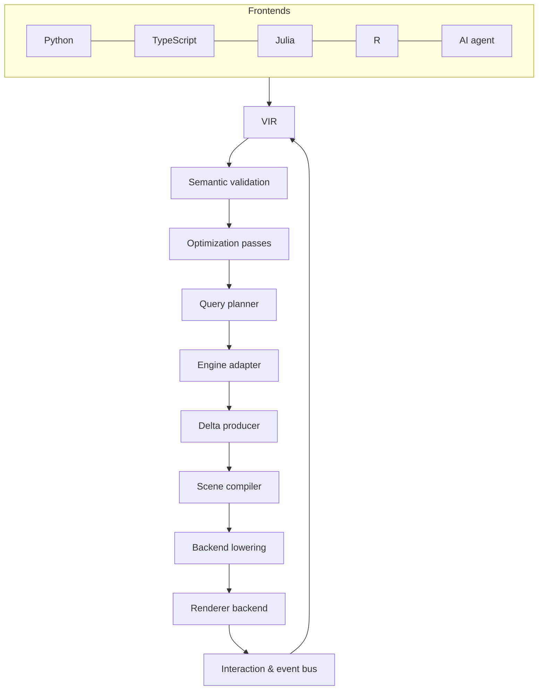

# Visualization IR — Authoritative Design

This is the single source of truth for what the library is and how it is built.
It defines the Visualization Intermediate Representation (VIR), the compiler
pipeline that consumes it, the runtime components, and the contracts between
them. It contains what is required to implement the system and nothing more.

---

## 1. Scope

A visualization is a **data structure** (the VIR), not an API. Frontends emit the
VIR; a compiler validates, optimizes, and lowers it; backends render it; an
execution engine materializes the data it references. The VIR is the canonical
artifact — serializable, immutable, versioned, and legible to both humans and
automated agents.

**In scope**

- A backend-independent IR for visualizations, with a canonical schema and both a
  human-readable (JSON) and a compact binary encoding.
- A compiler pipeline: frontend → semantic validation → optimization passes →
  backend lowering → execution.
- Column-oriented, delta-aware data binding by reference to engine tables
  (Deephaven default) and other columnar sources (Arrow, pandas, Polars).
- GPU-first rendering (WebGPU primary, WebGL2 fallback) plus vector/raster export
  backends, with existing libraries usable as lowering targets.
- Level-of-detail, downsampling, filtering, selection, and linked views as
  first-class, engine-abstracted capabilities.

**Non-goals**

- Not a general 2D scene/illustration tool; shapes exist to serve visualizations.
- Not a dashboarding/layout framework beyond what charts and subcharts require.
- The core does not hard-code exotic chart types; breadth arrives through plugins
  (§13) within the constraints of §2.

## 2. Design constraints (the gate)

Every feature must satisfy all three, or it is not admitted to the core:

1. **Performant.** No per-row work on the main thread. Expressible as
   columnar/GPU operations or engine-side ops. Supports incremental (delta)
   updates.
2. **Composable.** Expressible in the low-level IR with no bespoke code path, and
   composable with inheritance, scales, coordinates, and layout.
3. **Extensible.** Registrable through a documented extension point (geom, stat,
   scale, coord, engine op, or renderer backend), never hard-coded.

Additional invariants that constrain all components:

- **Immutable specifications.** Every transformation is a pure function
  `VIR → VIR`. Nothing mutates a document in place.
- **Reference, don't own.** Marks bind to column references, never to inline data
  arrays (inline data is permitted only for small constant sources). The IR stays
  small regardless of dataset size; the engine decides what to materialize.
- **Preserve semantics to the last stage.** A `scatter` remains a `scatter`
  through save/load/transport and only becomes draw primitives at backend
  lowering.
- **Determinism.** The resolver and all passes are pure functions of
  `(document, registry)`. Given `(data, viewport)`, tier selection and reduced
  output are deterministic.

### 2.1 Performance acceptance

Performance claims are acceptance criteria, not aspirations. Reference hardware,
browser versions, datasets, viewports, and byte budgets are recorded with every
benchmark baseline. On that profile:

- Steady-state pan/zoom is a view-uniform update and meets the display frame
  budget (16.7 ms at 60 Hz), independent of source row count.
- Main-thread work scales with events and compiled draw batches, never rows.
- Resident client memory and transferred bytes are bounded by the visible
  window, selected LOD tier, cache budget, and in-flight work budget.
- A 100M-row referenced source remains interactive because planning and
  materialization are pixel-bounded; CI includes large static and ticking
  datasets and fails on statistically significant frame-time, memory, transfer,
  or update-latency regressions.
- Every asynchronous stage has a latency and queue-depth budget. Exceeding one
  produces telemetry and controlled coalescing/cancellation, not unbounded work.

---

## 3. Architecture



Pipeline stages and contracts:

| Stage               | Input                    | Output                       | Contract                                                              |
| ------------------- | ------------------------ | ---------------------------- | --------------------------------------------------------------------- |
| Frontend            | author calls (any lang)  | VIR (an encoding)            | Emits VIR only; holds no behavior the IR cannot express.              |
| Semantic validation | VIR                      | validated VIR or diagnostics | Schema + cross-node rules; reports errors before rendering.           |
| Resolver/compiler   | VIR                      | resolved VIR + provenance    | Pure function of `(document, registry)`; deterministic.               |
| Optimization pass   | resolved VIR             | resolved VIR                 | Each pass is an independent, testable `VIR → VIR` rewrite.            |
| Query planner       | resolved VIR             | op plan (server/client)      | Cost- and capability-based; respects budgets; fails loud (§8).        |
| Engine adapter      | op plan + table refs     | columnar result handles      | Abstract ops (bin, aggregate, downsample, filter); Deephaven default. |
| Delta producer      | engine updates           | model patch + data patch     | RFC 6902 model patches; columnar row-range data patches (§9).         |
| Scene compiler      | resolved VIR + data      | backend-agnostic scene graph | No DOM/GPU calls; draw batches + hit-test metadata.                   |
| Backend lowering    | scene graph              | backend program/commands     | Target-specific; one interface per backend (§7).                      |
| Renderer backend    | commands + data buffers  | pixels + hit-test structures | Swappable; identical scene-graph interface across backends.           |
| Event bus           | pointer/keyboard, engine | model patches + callbacks    | Interactions are model mutations that round-trip through the VIR.     |

**Threading.** The resolver, planner, delta producer, and scene compiler run in a
worker. The renderer owns the GPU device. The main thread only marshals pointer
events and applies compiled draw commands. Authoring and diff work never block the
UI thread; slow composition is reported, not blocking.

The VIR is the serialized **semantic graph**. Op plans, materialized buffers,
scene graphs, and backend commands are derived **execution artifacts**: they are
regenerated, cacheable, and never become authored or persisted truth.

**Worker protocol.** A renderer owns a persistent worker session identified by a
generation. Commands and results carry monotonically increasing sequence and
generation IDs. Newer viewport/model commands supersede queued obsolete work;
results from stale generations are discarded. Transferable column buffers move
zero-copy where the platform permits. Queue depth and in-flight bytes are bounded,
errors are returned as node-addressed diagnostics, and worker restart reconstructs
state from the VIR, canonical column store, and transfer manifest.

---

## 4. The VIR (document model)

The VIR is an immutable, schema-validated data structure. JSON is the default
human-readable encoding; a compact binary encoding (§4.12) decodes to the
identical structure. The published JSON Schema drives validation, editor
generation, and agent tool-use.

Top-level structure:

```
Document
├── version      // schema version, for migration
├── data         // named data sources (engine refs, inline, derived)
├── classes      // reusable, inheritable property bundles
├── theme        // document-level class applied to everything
├── scales       // named scales/guides
├── coords       // named coordinate systems
├── layout       // constraint-based box layout of frames
├── frames[]     // panels; each holds marks and/or nested subcharts
│    └── marks[] // series and shapes (the unit of rendering)
└── selections   // named selection state (§10)
```

### 4.1 Nodes, IDs, and addressing

Every node (frame, mark, scale, axis, class, selection) carries a **stable ID**.
Nodes are addressable by JSON Pointer (e.g. `/frames/0/marks/2`) and by an
optional author-assigned `id`. Author IDs must be unique; duplicates are a
validation error. Stable addressing is what makes patches, provenance, events, and
linked selection tractable.

### 4.2 Marks: series and shapes

A **mark** is the unit of rendering. Two kinds share one schema:

- **Series** — data-bound. A series is a geom template repeated over the rows of a
  data source through encoding channels.
- **Shapes** — singleton marks (reference line, region, annotation, custom path)
  positioned in data or paper coordinates. Shapes may also be data-bound (one per
  group), which unifies annotations with faceting.

### 4.3 Encoding channels

A mark binds **channels** to data fields or constants; a **geom** interprets the
channels. Channels:

`x`, `y`, `z`, `x2`, `y2` (ranged geoms), `color`, `fill`, `size`, `shape`,
`opacity`, `angle`, `theta`, `radius`, `text`, `detail` (grouping without visual
effect), `order`, `key` (identity for delta/animation).

A channel binds to `{ field?, scale?, stat?, value? }`:

- `field` — a column reference within the mark's data source.
- `value` — a constant (mutually exclusive with `field`).
- `scale` — the named scale mapping data → visual units.
- `stat` — a transform to apply before scaling (§4.7).

### 4.4 Geoms and geom-from-arity

The IR accepts an explicit `geom`. If omitted, the resolver infers one from the
bound channels using this fixed table and **writes the inferred geom back into the
resolved document** (nothing is hidden):

| Bound channels          | Inferred geom      | Coord     |
| ----------------------- | ------------------ | --------- |
| `x` only (quantitative) | strip (horizontal) | cartesian |
| `y` only (quantitative) | strip (vertical)   | cartesian |
| `x` + `y`               | point (scatter)    | cartesian |
| `x` + `y` + `z`         | point (3D)         | 3d        |
| `x`/`y` + `x2`/`y2`     | interval           | cartesian |
| categorical `x` + `y`   | bar                | cartesian |
| `theta` (+ `radius`)    | arc (pie/donut)    | polar     |

Before inference, field types and coordinate compatibility are resolved. The
precedence is explicit geom, ranged channels, 3D, polar, categorical x/y, then
quantitative arity; therefore overlapping rows cannot produce two answers.
Inference is deterministic and never blocks the low-level model. Changing a mark
from scatter to line is the single-field change `geom: "line"` because both
consume `x`/`y`. A frontend may pin the geom to forbid inference.

Built-in geoms: point, line, area/band, step, bar/interval, arc, rect/heatmap
cell, hexbin, boxplot, violin, candlestick/OHLC, mesh/surface, text/label. Each
geom is a pluggable render primitive (§7) with a CPU hit-tester.

### 4.5 Coordinate systems

`coords` are named and referenced by frames. Built-ins: `cartesian`
(linear/log/symlog/time/categorical per axis), `polar`, `ternary`, `geo`, `3d`,
and `none` (paper space only, for indicators/pie/treemap that need no axes). A new
coord registers a projection plus axis generators. Marks are written once against
channels and reused across coords where geometrically meaningful.

A coord implementation declares dimensionality, accepted channel/geom classes,
domain constraints, `project`/`invert`, visible-bounds clipping, and axis/grid
generators. Projection and inversion operate on column batches, define precision
and invalid-value behavior, and are deterministic. A missing inverse disables only
interactions that require inversion and is a declared capability, never discovered
after rendering.

### 4.6 Scales and guides

Scales are named nodes with:

- `type` ∈ `linear`, `log`, `symlog`, `time`/business-time, `ordinal`,
  `quantize`, `threshold`, `sequential`, `diverging`.
- `domain` — explicit or `auto` (data-derived).
- `range` — explicit or palette reference.
- `guide` — axis, legend, or colorbar configuration.

Scales are **shared** across marks and frames (linked axes, shared color legend)
or **independent** per facet. Because scales are nodes, they inherit and compile
like everything else. Default categorical and sequential palettes are
colorblind-safe.

Business-time is a time-scale mode backed by a named, versioned calendar. Domain
mapping, inversion, ticks, pan/zoom, interval selection, and export all omit the
same non-business periods. Calendar identity/version participates in cache keys;
missing calendars or timezone ambiguity are validation errors. Deephaven calendar
adapters are the default implementation, but the scale contract is engine-neutral.
An instant-valued timestamp is UTC plus explicit display timezone; a local timestamp
must supply timezone and DST overlap/gap disambiguation (`earlier`, `later`, or
`reject`). Calendar registry keys are `(namespace, name, version, timezone)` and
the resolved immutable calendar definition is included in provenance.

### 4.7 Stats

A `stat` is an engine-abstracted transform requested by a channel or mark: `bin`,
`bin2d`, `count`, `sum`/`mean`/aggregation, `density`/`kde`, `quantile`
(box/violin), `smooth`/`regression`, `ecdf`, `hexbin`, `contour`. Stats keep chart
types uniform: a histogram is `geom: bar` + `stat: bin`, not a special type. The
query planner (§8) decides where each stat runs.

### 4.8 Classes and inheritance

`classes` is a **flat map**. A class may `extends` one or more other classes
(linear chains); no nested class definitions.

- A node applies classes via `class: ["a", "b"]`.
- Precedence is resolved by **C3 linearization** (the Python MRO algorithm) over
  the combined `extends` graph, producing a deterministic, unambiguous order.
  Ambiguous or cyclic graphs are validation errors.
- **Merge algebra:**
  - Objects **deep-merge** (nearer/later wins per key).
  - Scalars **replace**.
  - Arrays **replace by default**; arrays whose elements carry an `id` **merge by
    `id`**. Patch operators (`$append`, `$prepend`, `$remove`, `$replace`) are
    available where explicit control is needed.
  - A node's own inline properties always win over its classes.
- Classes may carry `data`/encoding defaults, not only style.
- `theme` is the document-level class; replacing it re-propagates.

The merge rules are total and deterministic, which is what makes provenance (§5.2)
tractable.

### 4.9 Layout

Layout is a **constraint-based box model**.

- The document is a tree of **frames** (boxes). A frame has a computed content box
  and holds a plot area plus edge-attached guides (axes, legends, colorbars).
- Sizing units: `fr` (fractional/flex), `px`, `%` (of parent), `auto`
  (content-driven, e.g. an axis sized to its tick labels), plus `min`/`max`/
  `aspect`. Gutters/margins are explicit.
- Placement is by **edge attachment** (`top`/`right`/`bottom`/`left`) and a
  **fractional grid** for facets/subcharts. Absolute placement is allowed for
  hand-tuning.
- The solver is a single pass over a DAG of constraints (no iterative relaxation
  in the common case). Resolved boxes are written into the compiled document.
- Multiple axes are first-class: an axis is a guide node bound to a scale and
  attached to a frame edge; several axes per edge are allowed (dual-y).
- Subcharts nest arbitrarily; faceting (`facet_wrap`/`facet_grid`) is expressed
  through the same grid with shared or independent scales.

### 4.10 Interactions and selections in the IR

Interactions are declared in the IR, not attached as ad-hoc callbacks:

- A mark or frame declares `interactions` (e.g. `on_select`, `on_click`) that name
  a selection and/or a server callback.
- `selections` are named nodes holding a predicate or key set (see §10). They can
  drive other marks/frames (linked brushing) and push down to the engine as
  filters.

Built-in input gestures are hover, click, double-click, pan, wheel/pinch zoom,
box/lasso select, drag, keyboard navigation, and legend activation. Their event
envelope is backend-independent and contains event type, target node ID, document
generation, screen/paper/data coordinates, modifier state, and either an exact
source/key reference or an aggregated-bin summary. It does not copy arbitrary row
payloads; requested columns are resolved through the data source.

Events first update declared selections/signals and produce model patches. A
declared callback may observe the same envelope and return patches; for explicitly
preventable events, a synchronous client decision or bounded server response may
suppress the documented default. Timeout/error applies the default and reports a
diagnostic. Callback names are registry references, never executable code embedded
in the VIR. Pan/zoom history, linked views, legend filtering, tooltips/crosshairs,
and keyed enter/update/exit transitions all use this event-and-patch path.

### 4.11 Versioning and migration

Each document declares `version`. The resolver runs forward migrations so a
document serialized by an older version loads in a newer one. This guarantee is
required for embedding VIR in notebooks, saved artifacts, and agent output.

`version` is required and uses `major.minor`. Minor revisions are additive and
must remain readable without semantic loss; incompatible changes increment major.
Migrations are ordered, pure, deterministic `VIR → VIR` passes registered for each
supported source version, preserve namespaced extension fields they do not own,
and emit provenance/diagnostics for every changed or dropped value. Unknown future
versions fail before data access. A release cannot remove a migration while saved
artifacts within the published support window may still reference it.
Migrations never guess when old syntax has multiple valid meanings: they stop with
a node-addressed conflict and documented choices. An explicit migration option may
select a choice, is recorded in provenance, and produces one canonical result.

### 4.12 Encodings

The VIR is an abstract structure with two encodings that both decode to the
identical IR:

- **JSON** — default, human-readable, `git diff`-friendly. Not protobuf-first;
  humans must be able to open and understand the artifact.
- **Binary** — one schema-generated, versioned codec selected and frozen before
  v1 for hot transport; it is not implementation-defined per frontend/backend.

Both encodings normalize to one canonical model: UTF-8 strings, finite JSON
numbers only, schema-defined integer widths, deterministic map ordering for
canonical serialization/hashing, and explicit tagged representations where JSON
cannot preserve a VIR type. Cross-language golden fixtures define byte-stable
canonical JSON and structural binary equivalence. Unknown core fields are errors;
unknown namespaced extension fields follow the owning extension's version policy.

Numeric data is never embedded in either encoding (§6); the structure stays small
regardless of dataset size.

---

## 5. Resolution, compilation, and optimization

### 5.1 Semantic validation

Before rendering, the document is validated against the schema plus cross-node
rules (references resolve, IDs are unique, scales/coords exist, channels are valid
for the geom). Failures produce node-addressed diagnostics. Validation runs
independently of any renderer so a frontend can surface errors immediately.

### 5.2 Compilation and provenance

The resolver produces a **compiled document**: inheritance flattened, encodings
resolved to explicit geoms, scale domains materialized, layout boxes computed.
With provenance enabled, each leaf value is annotated with its origin (class,
theme, override, default, planner). The compiled + annotated document is the
debugging surface and the machine-readable "explain this chart" for agents.

### 5.3 Optimization passes

Optimization is a pass manager running ordered, individually testable `VIR → VIR`
(and lowering-time) rewrites:

- **Level of detail** — insert decimation/aggregation tiers (§9.1).
- **Transform fusion** — collapse chained stats/filters into one engine op.
- **Constant folding** — resolve static scales/domains/layout at compile time.
- **Viewport pruning** — drop data and marks outside the visible window.
- **Batching** — merge compatible marks into single draw calls.
- **CSE / caching** — deduplicate identical data references and derived buffers
  (ties to the transfer cache, §9.1).

Passes compose deterministically; disabling a pass changes only its expected
output.

---

## 6. Data model and engine integration

- **Data sources** are named and are one of: an engine table reference (Deephaven
  default), an inline columnar array (small constants only), or a **derived
  source** (a source plus a chain of stats/filters).
- A channel `field` is a **column reference** (source + column + optional
  derivation), never an array. Structure and numeric data are separate: the
  structure serializes; the data stays in Arrow/Deephaven/pandas/Polars.
- Data is columnar and Arrow-compatible throughout. The client holds only a
  viewport- and LOD-bounded window.
- **Deephaven integration:** ticking tables drive the delta producer directly;
  aggregation/binning/downsampling run server-side; `plot_by` and business-time
  calendars are native.

### 6.1 Columnar data-plane contract

Adapters expose typed, chunked columns plus schema and stable source identity.
The portable boundary is Arrow-compatible buffers with explicit dtype, validity,
offset, length, timezone/calendar metadata, and dictionary identity; multi-chunk
columns and dictionary-encoded categoricals are first-class. Implementations
document alignment and ownership and use zero-copy transfer/FFI when compatible,
falling back to a measured conversion otherwise. Strings, large offsets, decimal,
timestamp, duration, categorical, boolean, and nested/unsupported dtypes either
have a declared lowering or fail validation before execution.

Chunks have immutable generation IDs and byte sizes. The planner owns leases for
materialized chunks; cancellation and eviction release them deterministically.
Schema changes are versioned source events: compatible additions can migrate a
plan, while removals or incompatible dtype changes invalidate it and require
revalidation. GPU encodings are backend execution details and never replace the
canonical source dtype.

The v1 core lowerings are explicit: numeric columns retain exact canonical CPU
types and use offset-encoded f32 or exact i32/u32 GPU attributes according to
range; i64/time/decimal ticks and readouts remain CPU-exact; booleans use bitsets
or u32; categoricals use versioned dictionary indices; UTF-8 is accepted for
labels, tooltips, grouping, and categorical dictionaries but not raw numeric
geometry. Decimal geometry is allowed only when offset/scale error is below the
viewport precision budget. Large-list, struct, union, and arbitrary object columns
require a registered lowering and otherwise fail validation.

---

## 7. Rendering

- **Backends.** WebGPU is primary. WebGL2 is the fallback for GPUs/browsers
  without WebGPU. SVG/Canvas2D and static PNG/PDF/HTML serve export and tiny
  charts. A backend implements one interface: consume lowered scene graph, produce
  pixels + hit-testing. Existing libraries (Plotly, Vega, ECharts, deck.gl) may be
  implemented as backends via the same interface.
- **Scene graph.** The scene compiler turns the resolved document + columnar
  buffers into a backend-agnostic scene graph: draw batches keyed by geom,
  referencing GPU buffers, scale uniforms, and hit-test metadata.
- **Geom render primitive.** Each geom provides, per backend, a shader/pipeline,
  plus a CPU hit-tester. New geoms register here.
- **GPU-resident columnar buffers.** Scale changes update uniforms (cheap); data
  changes update buffer sub-ranges; only geometry affected by a patch is
  re-encoded.
- **Numeric precision (offset-encoded f32).** The canonical store keeps source
  dtype (i64 timestamps, f64) on the CPU. The GPU receives _relative_ f32 via a
  per-trace/axis `offset + scale` folded into the view transform (which stays f64
  on the CPU). This preserves a 4-byte GPU footprint and full precision for
  large-magnitude/small-delta domains (time, finance, geo). Traces at different
  magnitudes get independent offsets. Deep zoom re-centers the offset from zone
  maps (§9.2) before f32 granularity is visible; log/symlog axes pin offset 0.
  Axis ticks, tick labels, and hover readouts are computed in f64/i64 and never
  routed through f32. Time is i64 end-to-end with calendar-aware tick generation.
- **GPU picking.** Hover/select renders integer IDs to an offscreen target with
  async readback — O(1) regardless of point count. Direct/decimated tiers return
  an exact source row; aggregated tiers return a bin summary plus drill-to-top-k.
- **GPU ceilings.** Tier selection accounts for fill-rate
  (`count × mark_pixel_area × overdraw`), not only point count. Large buffers are
  chunked into multi-buffer draws so the single-allocation cap (~1 GB) is never
  hit.
  Each geom/backend publishes a conservatively calibrated overdraw/cost estimator;
  reference scenes measure it and benchmark profiles version the defaults.
- **Recoverability.** All GPU state is rebuildable from the scene graph + canonical
  store; device/context loss is a reupload, not a crash.

---

## 8. Query planner and op negotiation

- Each engine adapter publishes **capability flags** (which ops it supports) and
  cost hints; each backend publishes its own capabilities.
- The planner assigns each op (stat, downsample, aggregate, filter) **server-side**
  when the engine supports it and data volume exceeds a budget (the common
  Deephaven case), otherwise **client-side**. Budgets are configurable (row count,
  bytes, latency target).
- If a required capability is unavailable anywhere, the document **fails loudly and
  early** with a precise diagnostic. Silent degradation is prohibited.

The planner consumes a typed op DAG with input/output schemas, ordering/key
requirements, incremental semantics, estimated rows/bytes, and accuracy metadata.
Capabilities are versioned semantic operation descriptors, not backend-name
checks; they declare supported dtypes, parameters, streaming/retraction behavior,
determinism, and error bounds. Plans may split/fuse work across engine, worker
kernel, and renderer only where those semantics remain equivalent.

Cost estimates use transfer bytes, resident bytes, compute latency, update rate,
viewport reuse, and configured accuracy/latency budgets. The selected placement,
estimates, rejected alternatives, and any approximation are written to provenance.
A plan is generation-scoped and cancellable; capability or source-schema changes
invalidate and rebuild it.

Adapter cost hints use common units and confidence bounds: fixed setup latency,
per-input-row/byte work, per-group/state bytes, output rows/bytes, incremental
update/retraction cost, and expected cache reuse. Calibration fixtures version the
hints per adapter; unknown estimates are explicit and choose the conservative plan
or fail when a hard budget cannot be proven.

---

## 9. Delta protocol and transport

Two coordinated patch channels, coalesced per animation frame:

1. **Model patches** — RFC 6902 JSON Patch operations (`add`/`remove`/`replace`/
   `move`) against the document, addressed by JSON Pointer / node ID. Used for
   config changes, interactions, and structural updates.
2. **Data patches** — columnar, table-oriented:
   `{ source, added: rowRanges, modified: rowRanges/cells, removed: rowRanges, shifts }`,
   mirroring engine update semantics. Only affected buffer sub-ranges are
   re-uploaded to the GPU.

Granularity default is the **column/row-range**; point-level diffs are opt-in for
small marks. Patches are coalesced within a frame and applied atomically so the
renderer never shows a half-applied state. `key`/`order` channels drive stable
enter/update/exit transitions.

Each transaction carries source/document generation, monotonic sequence, and base
generation. Receivers reject duplicates, buffer only a bounded reorder window, and
request a manifest/snapshot resync on a gap or base mismatch. Reconnect uses the
same snapshot + manifest path as a fresh client. Schema changes precede data that
uses the new schema. A patch invalidates dependent stats, scale domains, LOD tiles,
selection state, geometry neighbors, and caches through the execution dependency
graph before the atomic frame commit.

### 9.1 Transfer cache

A content-addressed, generation-keyed cache ensures the wire carries only what the
client lacks:

- Every transferable unit (column chunk, pyramid tile, decimation buffer, filter
  slab) has a stable ID:
  `(source, tier, tile|chunk, data_generation, filter_hash)`. Entries are
  **immutable** — a changed tile is a new ID, never an overwrite — so any ID the
  client holds is valid indefinitely; eviction is pure LRU under a byte budget.
- **Manifest handshake:** on a state change the producer sends the ID list the new
  view needs; the client requests only what it lacks; the producer ships only
  those. One round-trip, zero redundant bytes. A fresh client (empty cache)
  recovers through the same mechanism.
  Manifests and payloads are generation/sequence tagged, size-bounded, fragmented
  by negotiated transport limits, checksummed, and flow-controlled by in-flight
  bytes. Requests are idempotent; timeout/checksum failure retries held IDs and
  repeated failure falls back to snapshot + manifest resync.
- Per-interaction cost is explicit: pan within cached tiles = 0 bytes;
  theme/style change = 0 bytes (client uniforms/LUT); filter toggle back to a
  cached state = 0 bytes; a new filter ships recomputed visible tiles only.

### 9.2 Zone maps

At ingest, every column chunk gets a one-pass statistics block
(`min, max, count, null_count, sum, sum_sq`, plus dictionary cardinality for
categoricals). This buys O(chunks) autorange instead of O(rows), viewport chunk
pruning, instant accessibility summaries, and the domain for deep-zoom offset
re-centering (§7).

---

## 10. Filtering, selection, and linked views

Filtering is a first-class, three-tier model that mirrors the LOD ladder; a static
aggregate is stale under any dynamic predicate, so filters are handled explicitly:

Predicates are a typed VIR expression AST, never SQL/JavaScript or executable
strings. Core nodes are literals/parameters, field references, boolean composition,
comparisons, null tests, set membership, numeric/time ranges, and bounded string
operations; pure extension functions are versioned registry references. Type/null
semantics are engine-independent, canonical serialization defines `filter_hash`,
and adapters compile the AST or reject unsupported nodes. Validation caps AST
depth/node count, literal/set bytes, and operation-specific work before planning.

- **Tier A — indexed range predicates** (time windows, axis-linked ranges, numeric
  between): resolved by zone-map tile pruning + boundary re-bin. O(boundary).
- **Tier B — arbitrary predicates** (string contains, computed expressions,
  multi-column conditions): re-bin the **visible window only** (server-side on
  Deephaven), under stale-while-revalidate + progressive refinement.
- **Tier C — linked brushing across views:** a **summed-area (cumulative-sum)
  index** keyed on the active brushing dimension at bin resolution resolves any
  brush as a difference of cumulative sums — O(1) per bin, O(bins) per passive
  view, independent of row count. The index is sized proportional to bins (not
  rows), rebuilt when the active view changes, prefetched on idle.

**Selection is model state.** A per-row selection bitmask (1 bit/row) drives styled
selected/unselected rendering at every tier; aggregated tiers carry a
"selected-count" channel so a brush lights up density, not just direct marks. On
Deephaven, selections push down as engine filters. Every filter application records
which tier served it; no silent full rescans.
The planner records the tier, plan generation, approximation/error metadata, rows/
bytes scanned, and latency in provenance and structured runtime telemetry.

Selection identity is the declared `key` or an engine-stable row key, never a
transient viewport offset. Bitmasks are chunked and materialized only for resident
windows/tiles; the engine owns full-dataset predicates and key sets. Added,
removed, shifted, and re-keyed rows update selections transactionally with data
patches. Selection scope is document-level: every dependent mark is invalidated
automatically, while cross-document synchronization is an explicit host concern.

**Signals** are lightweight reactive values (zoom level, selection, hovered key)
evaluated in the worker that marks and LOD tiers bind to.

---

## 11. Level-of-detail and interaction latency

### 11.1 Tier ladder

Downsampling is a first-class, engine-abstracted op configured as
`downsample: { mode, target, strategy }` where `mode ∈ { off, count, auto }`
(`auto` is viewport- and DPI-aware). The governing rule: never ship or draw more
primitives than the screen has pixels. The tier is chosen per mark and re-chosen on
zoom over the visible window only, hysteresis-guarded:

1. **Direct** — raw columns, instanced draw. Exact. Budgeted by count and
   fill-rate (§7).
2. **Decimated** — M4 / min-max-per-pixel-column for lines/areas (keeps first,
   last, min, max so spikes and inter-column segments survive). Recomputed for the
   visible x-range only.
3. **Aggregated tile pyramid** — for massive scatter/heatmaps, a data-space pyramid
   of density tiles at power-of-two zoom levels (count/mean-color per cell). Pan =
   tile reuse; zoom = adjacent level; only zooming below the finest level re-bins,
   and only the visible window. Per-frame cost is O(visible tiles). Colormapping
   happens at composite time, so restyle never re-bins.
4. **Out-of-core tiling** — for larger-than-RAM data, chunked columns paged by
   viewport with pre-aggregated overview tiles; resident memory stays
   screen-bounded.

Point-heavy scatters/lines degrade to a binned density representation
(heatmap/hexbin) past a configurable point budget, sharing the `stat: bin2d` code
path. Semantic-zoom tiers (points → hexbin → heatmap) are just marks whose
visibility binds to a zoom signal. Reduction runs server-side on Deephaven where
possible; the tile machinery is shared with out-of-core tiling.

### 11.2 Latency budgets

- **Pan/zoom** — same frame: a uniform (view-matrix) update only; never blocks on
  recompute.
- **Tier rebuild after zoom** — non-blocking stale-while-revalidate: keep drawing
  the old tier transformed by the new view, swap when the worker/engine delivers.
- **Re-bin on large data** — progressive refinement: bin a 1-in-k sample first,
  refine over subsequent frames.
- **Hover** — async GPU-pick readback, tolerating 1-frame staleness.

---

## 12. Robustness

- **Nulls, NaN, gaps.** Arrow validity bitmaps are the single source of null truth
  (1 bit/value). NaN/invalid values never reach vertex buffers. A null inside a
  line is a gap (segmented at ingest); decimation treats gaps as hard edges;
  aggregations skip nulls and expose `count_valid` vs `count`.
- **Determinism and testing.** A CPU (software) rasterizer is the bit-deterministic
  reference oracle. Every backend is perceptual-diffed against it, and
  aggregate/decimated buffers are asserted bit-identical across backends. LOD
  decisions are part of the tested contract: given `(data, viewport)`, the chosen
  tier and reduced output are deterministic and asserted, so a visual change
  bisects cleanly to layout, LOD, or raster.
- **Dashboard scaling.** Browsers cap live GPU contexts. A context governor keeps a
  page under budget with LRU eviction of off-screen charts and rebuild-on-scroll,
  so a large dashboard does not blank its earliest charts.
- **Protocol and resource safety.** VIR, patches, Arrow metadata, expressions, and
  plugin registrations are untrusted inputs. Validation enforces depth/count/byte/
  allocation/work limits; filter expressions use a bounded declarative language;
  callbacks are allowlisted registry references; shader/native plugins run only
  under host policy. Tenant/source identity participates in cache keys, and
  diagnostics never expose unauthorized data.
- **Soak, fuzz, and observability.** Model/data protocols, migrations, parsers,
  planner placement, and device recovery are fuzzed. Long ticking/reconnect/filter
  sessions assert bounded memory and equivalence to a from-scratch render. Runtime
  metrics cover queue depth, dropped stale work, bytes transferred/resident,
  cache/tile hit rate, stage latency, frame time, selected LOD/filter tier, and
  recovery events.

---

## 13. Styling and theming

Data marks are GPU pixels, not DOM nodes, so styling splits into three surfaces:

- **(a) Chrome — CSS-native.** Axis labels, titles, legend, tooltips, hover
  readouts, and the container are real DOM/SVG, styleable with plain CSS/Tailwind:
  fonts, color, spacing, borders, focus states, and `@media` queries, with full
  cascade and inheritance.
- **(b) Marks — CSS custom-property token bridge.** The renderer reads `--chart-*`
  custom properties off its container at mount and maps them to GPU uniforms/LUTs
  (clear color, grid/axis color, series palette, colormap). Because the _variables_
  cascade, per-container theming, brand overrides, and
  `@media (prefers-color-scheme)` behave as a CSS author expects. A documented
  token vocabulary is the contract (`--chart-bg`, `--chart-grid`, `--chart-axis`,
  `--chart-text`, `--chart-series-N`, `--chart-colormap`, tooltip/selection/
  crosshair tokens). Custom-property colors a headless export cannot resolve
  (`oklch()`, `color-mix()`, `var()`) are normalized to fixed channels at the
  boundary so browser and server render identically. Live re-resolution watches
  `matchMedia` + a `MutationObserver`; because of the retained scene graph, a theme
  change is a uniform/LUT update (0 wire bytes), not a data re-upload.
- **(c) Per-mark, data-driven styling — spec-level.** Coloring by a data column or
  styling a selected point goes through encoding channels (`color=field`,
  `size=field`) and the selection bitmask (§10), resolved on the GPU. There is no
  CSS node for these.

**Programmatic parity and export.** Everything a token sets is also settable from
the frontend API. For kernel-side export to match on-screen CSS, the client
snapshots its resolved tokens back to the server so the exporter holds the
effective theme. On Deephaven, the token bridge binds to the existing web-client-ui
theme variables so charts inherit the app theme automatically.

---

## 14. Extensibility

Registrable extension points, each with a stable interface:

- **Geoms** (render primitive per backend + hit-tester).
- **Stats** (transform + engine op mapping).
- **Scales**, **coordinate systems**.
- **Engine adapters** (capability flags + ops).
- **Renderer backends** (scene-graph consumer).

Every registration is namespaced and versioned and declares schema fragments,
capabilities, deterministic semantics, incremental behavior, resource estimates,
and lowering support. Registration fails on collisions. A document that uses an
extension validates only with a compatible registry and fails before data fetch if
the selected engine/backend cannot lower it. Extension conformance runs the same
serialization, delta, determinism, resource, and backend tests as built-ins.

Extension IDs are `reverse.dns.namespace/name@major.minor`; documents require an
exact major and minimum minor, and canonical resolution records the exact installed
version. The registry key is `(kind, namespace, name, major)`, so incompatible
majors coexist and duplicate compatible registrations are collisions.

Interfaces are typed and batch-oriented:

- A geom declares required/optional channels, compatible coords/dtypes, bounds and
  neighbor-invalidation rules, scene-batch lowering, per-backend pipeline support,
  and CPU/reference hit-testing.
- A stat declares typed parameters and input/output schemas, ordering/grouping,
  incremental add/modify/remove/shift/retraction semantics, error bounds, and engine
  op mappings.
- A scale declares forward/inverse mapping, domain accumulation/retraction, ticks,
  and GPU-uniform lowering; a coord follows the projection contract in §4.5.
- Engine and renderer interfaces consume the typed op plan and versioned scene
  graph respectively and publish the capability descriptors in §8.

The VIR can reference installed extensions but cannot load or embed executable
code. Host policy independently allowlists extension/callback IDs and versions,
native/WASM/shader execution, network/data-source access, and resource limits.
Untrusted native or shader code is disabled; isolation is supplied by the host
process/container rather than claimed by the VIR. Declarative extensions remain
subject to schema and work-budget validation.

**Frontends** are thin and interchangeable: Python, TypeScript, Julia, R, and AI
agents all emit the same VIR, so a visualization authored in one language is
reproducible from another. **Plugins** add domain bundles (financial, mapping,
graph/network, timeline, scientific) using only these extension points; the core
language stays small.

The primary Python frontend has two layers: typed builders that map one-to-one to
the VIR and ergonomic constructors with arity sugar, pinned geoms, `plot_by`,
themes-as-classes, immutable transforms, validation, and serialization. Sugar must
lower to the same normalized VIR as the low-level builder and cannot retain hidden
behavior. Every additional frontend emits a shared golden corpus structurally
identical after canonical normalization.

---

## 15. Reduction/export kernel

The engine (Deephaven by default) is the primary compute tier: it performs
aggregation, binning, and downsampling server-side. A separate **reduction kernel**
provides the same primitives (M4/min-max decimation, bin2d, tile-pyramid build,
summed-area index) for two cases where no engine round-trip is available:

- the **client-side / non-Deephaven** fallback path, and
- **deterministic headless export**, which doubles as the CPU reference rasterizer
  (§12).

The kernel is built once and exposed both as a native library and a WASM build for
the browser fallback tier and static HTML export. It sits behind the engine
adapter interface (§8); it is a portable fallback, not the primary compute path.

---

## 16. Tooling

- **Schema-driven editor.** The published JSON Schema generates the editor UI; the
  editor tracks capabilities automatically. Editing a value produces the
  corresponding model patch.
- **Provenance / explain.** The compiled, annotated document (§5.2) is the human
  debugging aid and the machine-readable explanation for agents.
- **Authoring diagnostics.** Resolution and data-fetch run in a worker and warn
  when composition is slow (large class graphs, expensive derived sources), with
  timings attributed per node; they never block.
- **Deterministic export.** SVG/PNG/PDF plus the source VIR, for reproducibility
  and visual-regression testing.
- **Accessibility.** Keyboard navigation, ARIA roles, and generated text
  descriptions derived from the document (and zone-map summaries).

---

## 17. Reference: example document

A Deephaven-backed price chart: a themed class, a shared color scale, server-side
downsampling, a volume subchart, a dual axis, an annotation shape, and a selection.

```jsonc
{
  "version": "1.0",

  "data": {
    "trades": { "engine": "deephaven", "table": "TradesTicking" },
    "daily": {
      "source": "trades",
      "stat": { "op": "bin", "field": "ts", "unit": "1d" }
    }
  },

  "theme": "corp_dark",

  "classes": {
    "corp_dark": {
      "palette": "viridis",
      "font": "Inter",
      "grid": { "color": "#333" }
    },
    "price_line": {
      "extends": "corp_dark",
      "geom": "line",
      "encode": {
        "x": { "field": "ts", "scale": "x" },
        "y": { "field": "price", "scale": "y" }
      },
      "downsample": { "mode": "auto", "strategy": "lttb" }
    }
  },

  "scales": {
    "x": { "type": "time", "domain": "auto" },
    "y": {
      "type": "log",
      "domain": "auto",
      "guide": { "axis": { "side": "left" } }
    },
    "y2": {
      "type": "linear",
      "domain": "auto",
      "guide": { "axis": { "side": "right" } }
    },
    "col": {
      "type": "ordinal",
      "field": "symbol",
      "range": "palette",
      "guide": { "legend": { "side": "right" } }
    }
  },

  "coords": { "main": { "type": "cartesian" } },

  "layout": {
    "type": "grid",
    "rows": ["3fr", "1fr"],
    "gap": "8px",
    "areas": { "price": [0, 0], "volume": [1, 0] }
  },

  "frames": [
    {
      "id": "price",
      "coord": "main",
      "area": "price",
      "marks": [
        {
          "id": "px",
          "class": ["price_line"],
          "encode": { "color": { "field": "symbol", "scale": "col" } }
        },
        {
          "id": "vwap",
          "class": ["price_line"],
          "data": "daily",
          "encode": { "y": { "field": "vwap", "scale": "y" } },
          "style": { "dash": "4 2" }
        },
        {
          "id": "settle",
          "kind": "shape",
          "shape": "rule",
          "encode": { "y": { "value": 100.0, "scale": "y" } },
          "style": { "color": "#888" },
          "label": "settlement"
        }
      ],
      "interactions": {
        "on_select": { "selection": "brush", "channel": "x" },
        "on_click": { "callback": "handle_point_click" }
      }
    },
    {
      "id": "volume",
      "coord": "main",
      "area": "volume",
      "marks": [
        {
          "id": "vol",
          "geom": "bar",
          "data": "daily",
          "encode": {
            "x": { "field": "ts", "scale": "x" },
            "y": { "field": "volume", "scale": "y2" },
            "color": { "field": "symbol", "scale": "col" }
          },
          "downsample": { "mode": "count", "target": 2000 }
        }
      ]
    }
  ],

  "selections": {
    "brush": { "type": "interval", "channel": "x", "pushdown": true }
  }
}
```

Compiled + provenance-annotated form of the `px` mark (excerpt), showing resolved
inheritance, inferred geom, and planner-assigned values:

```jsonc
{
  "id": "px",
  "geom": "line", // @from class:price_line
  "coord": "main",
  "encode": {
    "x": { "field": "ts", "scale": "x" }, // @from class:price_line
    "y": { "field": "price", "scale": "y" }, // @from class:price_line
    "color": { "field": "symbol", "scale": "col" } // @from node:inline
  },
  "style": { "font": "Inter" }, // @from theme:corp_dark
  "grid": { "color": "#333" }, // @from theme:corp_dark
  "downsample": { "mode": "auto", "strategy": "lttb", "target": 1440 },
  // mode/strategy @from class:price_line; target @from planner
  "plan": { "downsample": "server", "estimated_rows_out": 1440 } // @from query-planner
}
```

---

## 18. Conformance: supported-plots matrix

Each plot must be expressible as geom(s) + coord + scales + stat + downsample with
no special-case code path. This matrix is the validation target for the model.
It is a minimum integration corpus, not the complete built-in contract: every geom,
stat, scale, coord, interaction, dtype, and extension interface named in this
document also requires positive, invalid-input, delta, serialization, determinism,
and supported-backend conformance fixtures.

| Plot             | Geom(s)      | Coord     | Stat/op         | Downsample      |
| ---------------- | ------------ | --------- | --------------- | --------------- |
| Scatter          | point        | cartesian | —               | density/hexbin  |
| Line/area        | line/area    | cartesian | —               | LTTB / min-max  |
| Bar (grouped)    | bar/interval | cartesian | aggregate       | count           |
| Histogram        | bar          | cartesian | bin             | server-side bin |
| 2D density       | rect/hexbin  | cartesian | bin2d/hexbin    | server-side bin |
| Box / violin     | box/violin   | cartesian | quantile/kde    | server-side     |
| OHLC/candlestick | candlestick  | cartesian | aggregate       | count           |
| Heatmap          | rect         | cartesian | bin2d/aggregate | server-side bin |
| Pie/donut        | arc          | polar     | sum             | —               |
| Sunburst/treemap | arc/rect     | none      | hierarchy       | —               |
| Indicator/KPI    | text/gauge   | none      | aggregate       | —               |
| 3D scatter/surf  | point/mesh   | 3d        | — / grid        | LOD             |
| Choropleth       | rect/path    | geo       | aggregate       | tile LOD        |

```

```
